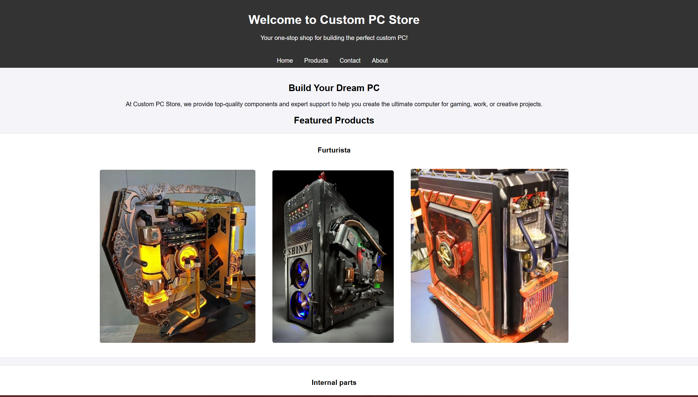
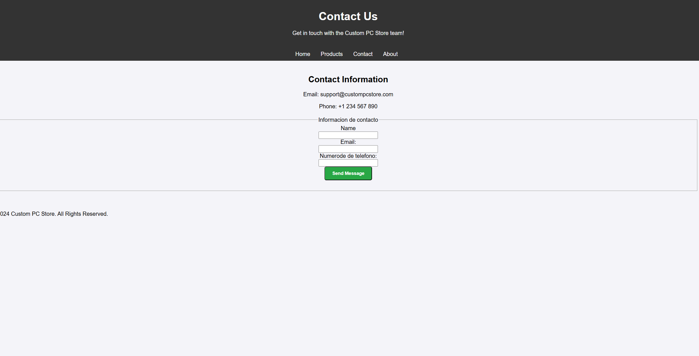
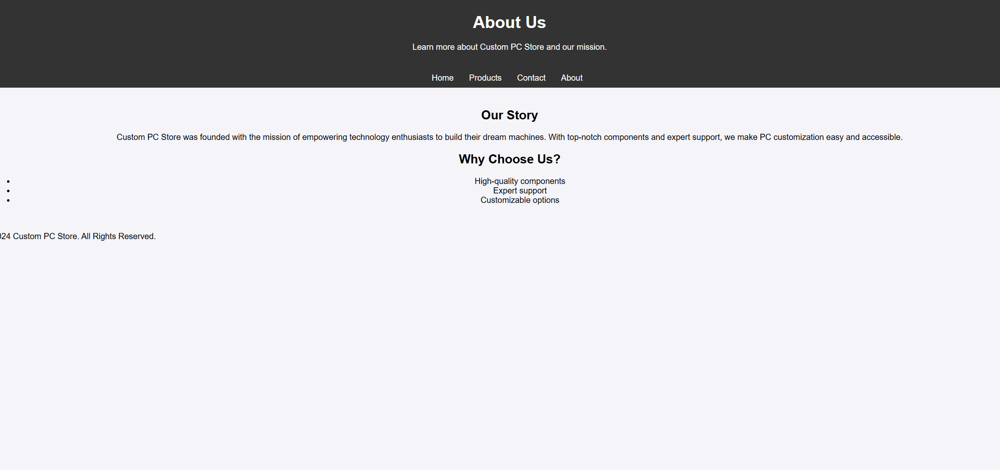

>[!IMPORTANT]
>No se me ocuerre nada de que ponerte sobre el trabajo porque se me van a acabar las ideas en 2 o 3 prarrafos, a partir de hay te pondre el quijote

# Custom Pc store
Custom PC Store se fundó con la misión de empoderar a los entusiastas de la tecnología para que construyan las máquinas de sus sueños. Con componentes de primer nivel y soporte experto, hacemos que la personalización de la PC sea fácil y accesible.
Se creo para poder personalizar cualquier tipo de PC como tu quieras sin que surjan problemasen su construccion.

## 1. Idea principal 
Nuestra idea principal para Custom Pc store fue la creacion e inobasion sostenible de piezxas personalizadas
>[!Note]
>Entre los integrantes del grupo savemos que es un deseo muy habicioso porque se a hecho muy poco pero estamos sacando salida poco a poco
## 2. Listado de HTML 
|     HTML                  |   Contenido     |      |
|---------------------------|---------|-----|
|  proyecto iuntermdular    |  Imagenes para visualizar lo que hacemos|      |
|  productos                |  Seccion para comprar       |           |  
|  contacto_proyect         |  Seccion para poder acer peedidos especificos o hablar con nosotros  |     |
|  sobre nosotros           |   Nuestra Historia       |      |

### 3. Donde robe la idea
Para que mentirnos esto no se nos ocurrio derrepente buscando sinquerer encontre la paquina para tunear PC (https://centergamingespana.com)[https://centergamingespana.com/modding-pc-menu/]

## Tareas completadas
- Debe tener el texto bien organizado usando encabezados de varios niveles
  - [x] *COMPLETADO*

- Debes usar tablas para identificar las páginas html de tu proyecto y lo que contienen
  - [x] *COMPLETADO*
- Debes crear alguna captura de pantalla y hacer que se muestre en tu Readme.md. Asegúrate de que se ve correctamente, ni muy grande ni muy pequeña. Si es necesario redimensionar la imagen hazlo.
  - [x] *COMPLETADO*
- Debes usar vínculos a otras páginas (relacionadas con tu contenido o con herramientas necesarias).
  - [x] *COMPLETADO* 
